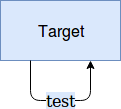
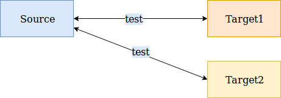

# dda-serverspec-crate

[](https://clojars.org/dda/dda-serverspec-crate)
[](https://travis-ci.org/DomainDrivenArchitecture/dda-serverspec-crate)

[](https://clojurians.slack.com/messages/#dda-pallet/) | [ DevOps Hacking with Clojure](https://www.meetup.com/de-DE/preview/dda-pallet-DevOps-Hacking-with-Clojure) | [Website & Blog](https://domaindrivenarchitecture.org)

## Jump to
[Local-remote-testing](#local-remote-testing)
[Usage](#usage)
[Additional-info-about-the-configuration](#additional-info-about-the-configuration)
[Targets-config-example](#targets-config-example)
[Serverspec-config-example](#serverspec-config-example)
[Reference](#reference)
[Targets](#targets)
[Serverspec](#serverspec)
[Infra-API](#infra-api)
[Compatibility](#compatibility)

## Features
The dda-serverspec-crate allows you to specify target-systems expected state and test against current state. dda-serverspec-crate provides:
* execution against localhost, remote hoste or multiple remote hosts.
* files or folders presence / absence.
* packages are installed / uninstalled
* services listening to ip & port
* validity of certificate files
* validity of certificates by https
* network connectivity to remote systems

  <a href="https://asciinema.org/a/163372?autoplay=1"></a>

## Local-remote-testing
There are two modes of testing targets, either local or remote. For local tests are executed on the node the jar is running. Tests are executed by the current user.



For remote tests the dda-serverspec-crate can be used from a source machine to test different aspects of the remote target machines. Test are executed by ssh & bash. Just tools like curl has to be installed on target systems.



For remote tests the dda-serverspec-crate can be used from a source machine to test different aspects of the remote target machines.

## Usage
1. **Download the jar-file** from the releases page of this repository (e.g. dda-serverspec-crate-x.x.x-standalone.jar)
1. **Create the ```serverspec.edn``` configruration** file in the same folder where you saved the jar-file. The ```serverspec.edn``` file specifies the tests that are performed against the server(s). You may use the following example as a starting point and adjust it according to your own needs:
   ```clojure
{:netstat [{:process-name "sshd" :port "11" :running? false}  ;check if sshd is NOT running on port 11
           {:process-name "sshd" :port "22"}         ;check if sshd is running on port 22
           {:process-name "sshd" :port "22" :exp-proto "tcp6" :ip "::"}]
 :file [{:path "/root/.bashrc"}                      ;check if file exists
        {:path "/etc"}                               ;check if folder exists
        {:path "/absent" :exist? false}]             ;check if file doesn't exists
 :netcat [{:host "www.google.com" :port 80}          ;check if host is reachable
          {:host "www.google.c" :port 80 :reachable? false}]
 :package [{:name "test" :installed? false}          ; check if package test is NOT installed
           {:name "nano"}]                           ; check if package nano is installed
 :http [{:url "https://domaindrivenarchitecture.org" ;provide full url
         :expiration-days 15}]}                      ; check if certificate of url is at least 15 days valid
  ```
3. (optional) If you want to perform the tests on a remote server, please create additionally a ```targets.edn``` file. In this file you define gainst which server(s) the tests are performed and the corresponding login information. You may use and adjust the following example config:
   ```clojure
{:existing [{:node-name "target1"                      ; semantic name (keep the default or use a name that suits you)
             :node-ip "192.168.56.104"}]               ; the ip4 address of the machine to be provisioned
             {:node-name "target2"                     ; semantic name (keep the default or use a name that suits you)
                          :node-ip "192.168.56.105"}]  ; the ip4 address of the machine to be provisioned
 :provisioning-user {:login "initial"                  ; user on the target machine, must have sudo rights
                     :password {:plain "secure1234"}}} ; password can be ommited, if a ssh key is authorized
```

4. (optional) If you want to ensure, that certain test tools (like netcat or netstat) are present on the target system, you can once use the ```--install-dependencies``` option:

  ```bash
  java -jar dda-serverspec-crate-standalone.jar --install-dependencies --targets targets.edn test.edn
  ```

5. **Run the jar** with the following options and inspect the output.
  For testing against localhost:
  ```bash
java -jar dda-serverspec-crate-standalone.jar serverspec.edn
  ```

  For testing remote server(s) please specify the targets file:

```bash
java -jar dda-serverspec-crate-standalone.jar --targets targets.edn serverspec.edn
```

## Additional-info-about-the-configuration
Two configuration files are required by the dda-serverspec-crate:: "serverspec.edn" and "targets.edn" (or similar names). These files specify both WHAT to test resp. WHERE. In detail: the first file defines the configuration for the actual tests performed, while the second configuration file specifies the target nodes/systems, on which the tests will be performed. The following examples will explain these files more in details.

(**Remark:** The second file "targets.edn" is *optional*. This means, if none is specified, then a default file is used, which defines that the tests are performed against  **localhost**.)


### Targets-config-example
```clojure
{:existing [{:node-name "test-vm1"
             :node-ip "35.157.19.218"}
            {:node-name "test-vm2"
             :node-ip "18.194.113.138"}]
 :provisioning-user {:login "ubuntu"}}
```
The keyword ```:existing``` has to be assigned a vector, that contains maps with the information about the nodes.
The nodes are the target machines that will be tested. The ```node-name``` has to be set to be able to identify the target machine and the ```node-ip``` has to be set so that the source machine can reach it.
The ```provisioning-user``` has to be the same for all nodes that will be tested. Furthermore, if the ssh-key of the executing host is authorized on all target nodes, a password for authorization can be omitted. If this is not the case, the provisioning user has to contain a password.

### Serverspec-config-example
```clojure
{:netstat [{:process-name "sshd" :port "11" :running? false}
           {:process-name "sshd" :port "22"}
           {:process-name "sshd" :port "22" :exp-proto "tcp6" :ip "::"}]
 :file [{:path "/root"}
        {:path "/etc"}
        {:path "/absent" :exist? false}]
 :netcat [{:host "www.google.com" :port 80}
          {:host "www.google.c" :port 80 :reachable? false}]
 :package [{:name "test" :installed? false}
           {:name "nano"}]}
```
The serverspec config file determines the tests that are executed. For example the part containing ```{:path "/root"}``` checks if the folder ```/root``` exists.
There are different types of tests that can be used. More details can be found in the reference below.


## Reference
We provide two levels of API - domain is a high level API with many built-in conventions. If these conventions don't fit your needs, you can use our low-level API (infra) and realize your own conventions.

### Domain API

#### Targets
The schema of the domain layer for the targets is:
```clojure
(def ExistingNode
  "Represents a target node with ip and its name."
  {:node-name s/Str   ; semantic name (keep the default or use a name that suits you)
   :node-ip s/Str})   ; the ip4 address of the machine to be provisioned

(def ExistingNodes
  "A sequence of ExistingNodes."
  {s/Keyword [ExistingNode]})

(def ProvisioningUser
  "User used for provisioning."
  {:login s/Str                                ; user on the target machine, must have sudo rights
   (s/optional-key :password) secret/Secret})  ; password can be ommited, if a ssh key is authorized

(def Targets
  "Targets to be used during provisioning."
  {:existing [ExistingNode]                                ; one ore more target nodes.
   (s/optional-key :provisioning-user) ProvisioningUser})  ; user can be ommited to execute on localhost with current user
```
The "targets.edn" file has to match this schema.

#### Serverspec
The schema for the tests is:
```clojure
(def ServerTestDomainConfig
  {(s/optional-key :package) [{:name s/Str
                               (s/optional-key :installed?) s/Bool}]
   (s/optional-key :netstat) [{:process-name s/Str             ; works only for sudoer.
                               :port s/Str
                               (s/optional-key :running?) s/Bool
                               (s/optional-key :ip) s/Str
                               (s/optional-key :exp-proto) s/Str}]
   (s/optional-key :file) [{:path s/Str
                            (s/optional-key :exist?) s/Bool}]
   (s/optional-key :netcat) [{:host s/Str
                              :port s/Num
                              (s/optional-key :reachable?) s/Bool}]
   (s/optional-key :certificate) [{:file s/Str                ; incl path as e.g. /path/file.crt
                                   :expiration-days s/Num}]   ; min days certificate must be valid
   (s/optional-key :http) [{:url s/Str                        ; url e.g. http://google.com
                            :expiration-days s/Num}]})        ; min days certificate must be valid
```
The "tests.edn" file has to match this schema.
The default value is that the test expects a positive boolean (e.g. :reachable? true) and this value can be omitted.

### Infra-API
The infra configuration is a configuration on the infrastructure level of a crate. It contains the complete configuration options that are possible with the crate functions.
On infra level we distinguish between collecting facts (done in the settings phase without side effects) and testing (done in test phase intentionally without side effects).
Settings can also be used without tests in order to provide informations for conditional installations / configurations.

The schema is:
```clojure
(def ServerTestConfig {
 (optional-key :netcat-test)
 {Keyword {:reachable? Bool}},          ; keyword is used to match test against fact
 (optional-key :netcat-fact)            ; parsed result of "nc [host] -w [timeout] && echo $?"
 {Keyword {:port Num,
           :host Str,                   ; may be ip or fqdn
           :timeout Num}},              ; timeout given in seconds
 (optional-key :netstat-test)
 {Keyword {:ip Str,
           :running? Bool,
           :port Str,
           :exp-proto Str}},
 (optional-key :netstat-fact) Any,      ; parsed result of "netstat -tulpen". Any is ignored.
 (optional-key :file-test)              ; fact can be only collected by sudoers
 {Keyword {:exist? Bool}},
 (optional-key :file-fact)              ; parsed result of "find [path] -prune -printf \"%p'%s'%u'%g'%m'%y'%c'%t'%a\\n\"
 {Keyword {:path Str}},
 (optional-key :package-test)
 {Keyword {:installed? Bool}},
 (optional-key :package-fact) Any})      ; parsed result of "dpkg -l". Any is ignored.
```
On the level of the infrastructure we break down the tests into gathering the facts and testing them against the expected value.
These results are returned in a map that follows the schema depicted above.

## Compatibility
dda-pallet is compatible with the following versions
 * pallet 0.8
 * clojure 1.7
 * (x)ubunutu 16.0

## License
Published under [apache2.0 license](LICENSE.md)
